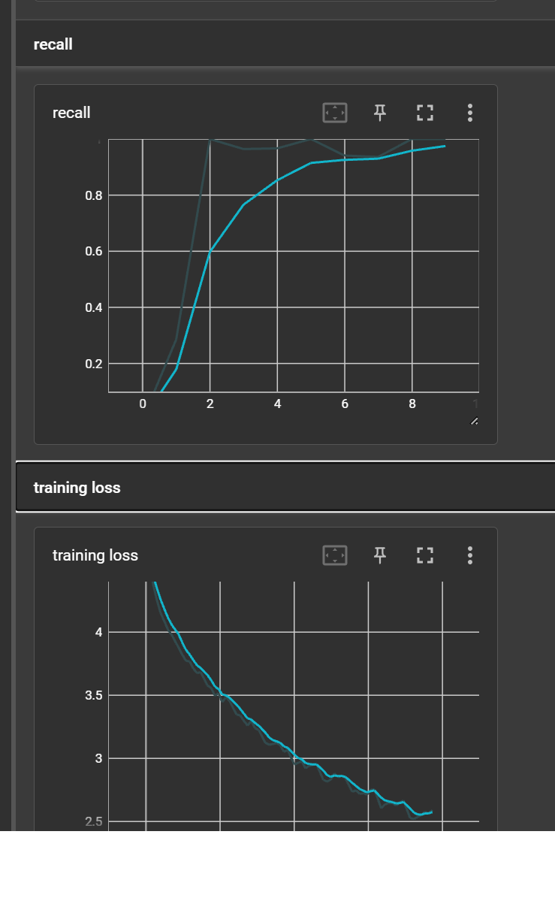

# Lenet-AlexNetImplementation

# IMPLEMENTACION - PART 1
## LeNet5 Learning

## AlexNet Learning

### Métrica de Desempeño:
Para problemas de clasificación, una métrica comúnmente utilizada es la precisión (accuracy). Esto mide el porcentaje de imágenes que el modelo clasifica correctamente. Es intuitiva y fácil de entender, y es apropiada para datasets como MNIST y CIFAR10 donde las clases están bastante equilibradas. Pero para AlexNet fue encesario usar el recall ya que el precision al ser un dataset desbalanceado no era muy representativo

### Respuestas a las Preguntas:  
#### a. Diferencia principal entre ambas arquitecturas:
LeNet-5 fue una de las primeras arquitecturas de redes neuronales convolucionales, diseñada principalmente para reconocer dígitos. Su diseño es más sencillo y tiene menos capas y parámetros. AlexNet, por otro lado, es mucho más profunda y fue diseñada para tratar con datasets de imágenes más complejos y de mayor resolución, como ImageNet. Utiliza más capas convolucionales, capas completamente conectadas más grandes y técnicas modernas como la activación ReLU y el dropout.

#### b. ¿Podría usarse LeNet-5 para un problema como el que resolvió usando AlexNet? ¿Y viceversa?  
Sí, ambas redes pueden ser usadas para ambos datasets, pero la eficacia variará. Si usamos LeNet-5 en datasets más complicados como CIFAR10 o ImageNet, podría no tener el poder representacional suficiente para lograr un alto rendimiento debido a su simplicidad. AlexNet, aunque es más pesado, podría usarse para MNIST, pero es probable que sea excesivo y no tan eficiente en términos de recursos computacionales.

#### c. Qué le pareció más interesante de cada arquitectura:  

**LeNet-5:** Es asombroso cómo esta arquitectura temprana, con su diseño sencillo, sentó las bases para las CNNs futuras. Su eficacia en la clasificación de dígitos a mano fue revolucionaria en su momento.  
**AlexNet:** Lo que es destacable de AlexNet es cómo utilizó técnicas modernas y una arquitectura más profunda para lograr un rendimiento nunca antes visto en ImageNet, superando a otros enfoques tradicionales de procesamiento de imágenes. También es notable cómo popularizó las GPUs para entrenar redes neuronales, dado que fue entrenada usando GPUs.

# INVESTIGACION - PART 2
### Investigue e indique en qué casos son útiles las siguientes arquitecturas, agregue imagenes si esto le ayuda a una mejor comprensión  
**a. GoogleNet (Inception)**  
GoogleNet, o Inception, revolucionó el campo de la visión por computadora al
ganar el concurso ImageNet en 2014. Su diseño innovador introduce "módulos de
Inception", que son combinaciones de diferentes operaciones de convolución y
pooling ejecutadas en paralelo. Estos módulos permiten que la red capture
características en múltiples escalas, haciendo de Inception una opción poderosa
para tareas de reconocimiento visual en conjuntos de datos grandes.  

**b. DenseNet (Densely Connected Convolutional Networks)**
DenseNet es una arquitectura caracterizada por sus conexiones densas
entre las capas, donde cada capa recibe entradas de todas las capas anteriores.
Esta estructura de conexión densa mejora el flujo de información y gradientes a
través de la red, y permite un uso más eficiente de los parámetros. DenseNet es
particularmente útil en situaciones donde la eficiencia de la memoria es crítica y en
conjuntos de datos con recursos limitados.  

**c. MobileNet**  
Diseñado para ser ligero y eficiente, MobileNet es ideal para dispositivos con
restricciones de cómputo como teléfonos móviles y dispositivos embebidos. Esta
arquitectura logra su eficiencia mediante el uso de convoluciones separables en
profundidad, que reducen significativamente la cantidad de cálculos necesarios.
Aunque puede haber un ligero compromiso en la precisión, su rapidez y tamaño
reducido lo hacen perfecto para aplicaciones en tiempo real en dispositivos móviles.  

**d. EfficientNet**  
EfficientNet destaca por su método de escalado compuesto que determina
cómo crecer la red, equilibrando ancho, profundidad y resolución. Esta estrategia
permite que EfficientNet alcance niveles de precisión comparables a otros modelos
más grandes, pero con un número significativamente menor de parámetros. Es una
excelente opción cuando se busca alta precisión con un modelo eficiente en
términos de tamaño y cómputo.

### ¿Cómo la arquitectura de transformers puede ser usada para image recognition?
Vision Transformer (ViT) es un ejemplo de una arquitectura que usa esta idea y ha
demostrado tener un rendimiento comparable o incluso mejor que las arquitecturas CNN
tradicionales en conjuntos de datos grandes como ImageNet.

Es importante notar que los transformers requieren grandes cantidades de datos y cómputo
para entrenarse desde cero, pero han demostrado ser altamente efectivos cuando se
preentrenan en grandes conjuntos de datos y luego se afinan en conjuntos de datos más
pequeños

### Referencias
* VisibleBreadcrumbs. (2023). Mathworks.com.
https://es.mathworks.com/help/deeplearning/ref/googlenet.html

* Papers with Code - DenseNet Explained. (2020). Paperswithcode.com.
https://paperswithcode.com/method/densenet

* VisibleBreadcrumbs. (2023). Mathworks.com.
https://es.mathworks.com/help/deeplearning/ref/mobilenetv2.html

* Papers with Code - EfficientNet Explained. (2020). Paperswithcode.com.
https://paperswithcode.com/method/efficientnet

